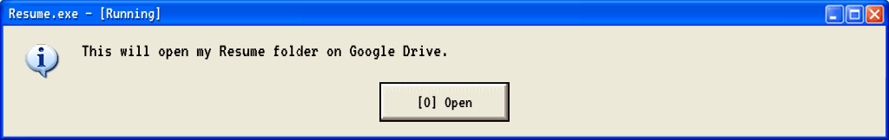

```md
[ System ] Launch sequence initiated.

     ┌───────────┐
     │           │   Deivis: 
     │   ⚪  ⬛  ⚪   <says> Welcome to |DaaveyOs| v22.9.25, user!
     └───────────┘
```

```md
     ┌───────────┐
     │           │   Deivis: 
     │   ⚪  ‿  ⚪   <says> I'm here to guide you through my professional
     └───────────┘           journey. Explore my repositories and feel free to contact me!
```

---

```plain
==> Booting DaaveyOS [2.24-about]
/dev/sda3: recovering journal
/dev/sda3: clean, 238075/59965440 files, 6019093/239842481 blocks

  --> Starting system initialization...

[    0.01s] :: Loading kernel modules
[    0.03s] :: Initializing hardware detection
[    0.05s] :: Starting udev daemon
[    0.07s] :: Mounting filesystems
[    0.09s] :: Loading network interfaces
[    0.12s] :: Starting system services

==> Login successful. Welcome back, Deivis!

[root@user ~]# fastfetch

      ___           ___            root@user 
     /__/\         /  /\           
    |  |::\       /  /::|          OS  Linux 6.11.5-arch1-1
    |  |:|:\     /  /:|:|          Host  DaaveyOS Professional Workstation
  __|__|:|\:\   /  /:/|:|__        Kernel  6.11.5-arch1-1
 /__/::::| \:\ /__/:/ |:| /\       Uptime  Learning since 2020
 \  \:\~~\__\/ \__\/  |:|/:/       Shell  zsh 5.9
  \  \:\           |  |:/:/        DE  Hyprland (Wayland)
   \  \:\          |  |::/         CPU  Always processing new ideas
    \  \:\         |  |:/          Memory  Constantly expanding knowledge
     \__\/         |__|/           GPU  Rendering creative solutions

[root@user ~]# ls ~/projects/
📂 portfolio-website/     📂 linux-server-configs/    📂 cybersec-tools/
📂 design-showcase/       📂 automation-scripts/      📂 learning-projects/

[root@user ~]# whoami --skills
🔧 Backend: Python, Java, C++
🌐 Frontend: HTML5, CSS3, TypeScript  
🖥️ Systems: Linux Administration, Network Security, DevOps
🎨 Design: Illustrator, Premiere Pro, Blender, Figma

[root@user ~]# contact --help
📧 Email: Available in resume
💼 LinkedIn: Check resume links below
🐙 GitHub: You're already here! 😄
📄 Resume/CV: Use 'resume --download' for links

[root@user ~]# resume --download
```

```md
     ┌───────────┐
     │    ︵  ‿  ︵   Deivis:
     │           │   <thinking> 
     └───────────┘

     ┌───────────┐
     │           │   Deivis: 
     │   ⚪  ⬛  ⚪   <says> Handing control to the Resume window.
     └───────────┘
```

[](https://drive.google.com/drive/folders/1oYNx0hEfAhGNUxD47JWJN1M44ndzPiUd?usp=sharing)

```md
     ┌───────────┐
     │           │   Deivis: 
     │   ⚪  ‿  ⚪   <says> Feel free to reach out after reviewing my experience!
     └───────────┘

[root@user ~]# █
```
